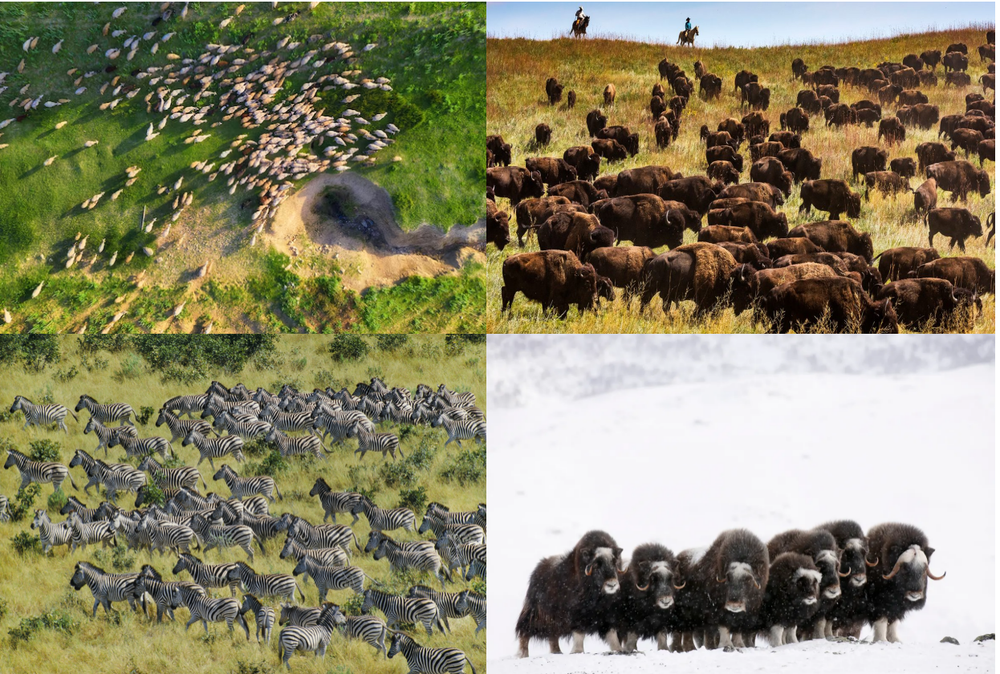
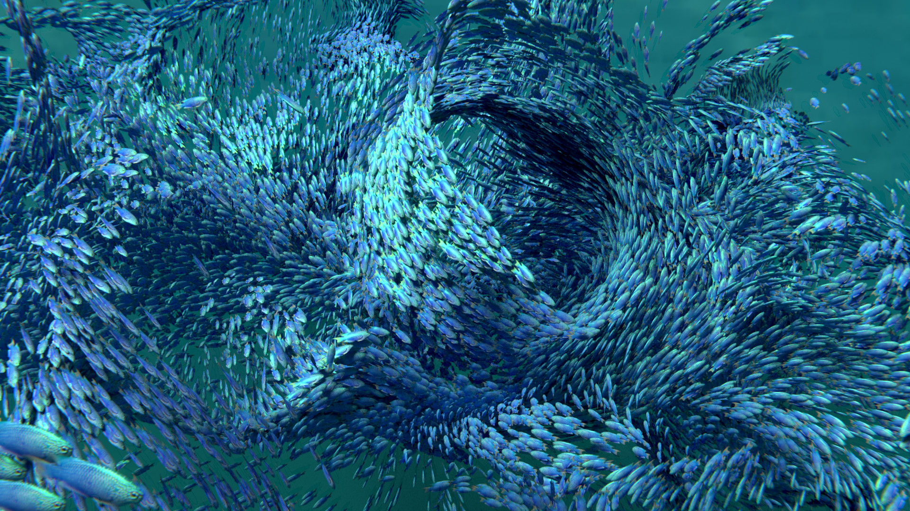
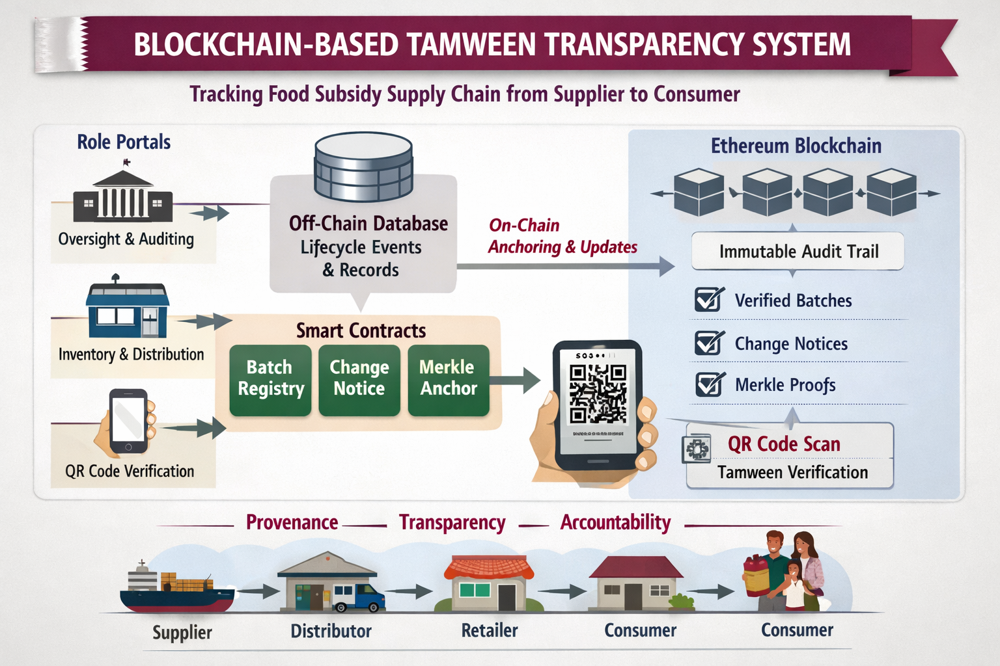

#  Hi, I'm Iroda Ibrohimova
I am an Information Systems student at Carnegie Mellon University. My primary focus is Data Science and Machine Learning, though I enjoy exploring diverse technologies including blockchain and database architecture. Below is a selection of my recent work.

---

## Projects
<table><tr><td width="300"></td><td><h3>Deforestation Risk Prediction along Brazil's BR-163 Corridor</h3>
Built a geospatial ML pipeline to predict deforestation risk across 342,819 grid cells in the Brazilian Amazon, combining five open data sources. Final XGBoost model achieves AUC-ROC 0.990 and Recall 0.947.

<b>Tech Stack:</b> Python, XGBoost, scikit-learn, geopandas, pandas
 <a href="https://github.com/iibrohim-hash/br-163">View Repository</a></td></tr></table>

<table><tr><td width="300"></td><td><h3>Classifying Animal Swarms from an Aerial Viewpoint</h3>
Built a 6-class image classifier for aerial and side-view herd imagery across 9 experiments. Final model (ResNet50 + SVM) achieves 93.30% test accuracy on 5,870 labeled images spanning Buffalo, Elephant, Hoofed Grazers, Musk Ox, Wildebeest, and Zebra.

<b>Tech Stack:</b> Python, ResNet50, scikit-learn, TensorFlow/Keras, OpenCV, Selenium
<a href="https://github.com/iibrohim-hash/animalHerDetection">View Repository</a></td></tr></table>

<table> <tr> <td width="300"></td> <td> <h3>Synthetic Data for Animal Counting & Detection</h3> 
Generated synthetic animal group datasets in Blender to improve object counting and detection. Evaluated YOLOv8 and CSRNet on fish, bird, and mammal datasets.
 
<b>Tech Stack:</b> Blender, Python, YOLOv8, CSRNet, PyTorch
 <a href="https://github.com/iibrohim-hash/blender-synthetic-data-animal-counting">View Repository</a> </td> </tr> </table>

<table> <tr> <td width="300"></td> <td> <h3>UrbanPoint Database System</h3> 
Developed a full database design and implementation for a subscription and offer-redemption platform. Includes UML modeling, BCNF normalization, and analytical SQL queries.
 
<b>Tech Stack:</b> PostgreSQL, SQL, Python
 <a href="https://github.com/iibrohim-hash/urbanpoint">View Repository</a> </td> </tr> </table>

<table> <tr> <td width="300"></td> <td> <h3>Supply Chain Transparency Blockchain</h3> 
Implemented a blockchain-based system for secure, immutable tracking of supply chain transactions using smart contracts to ensure data integrity.
 
<b>Tech Stack:</b> Solidity, Blockchain
 <a href="https://github.com/iibrohim-hash/Blockchain">View Repository</a> </td> </tr> </table>

---

##  Contact
Email: iibrohim@andrew.cmu.edu  
LinkedIn: www.linkedin.com/in/iroda-ibrohimova-73098924a
